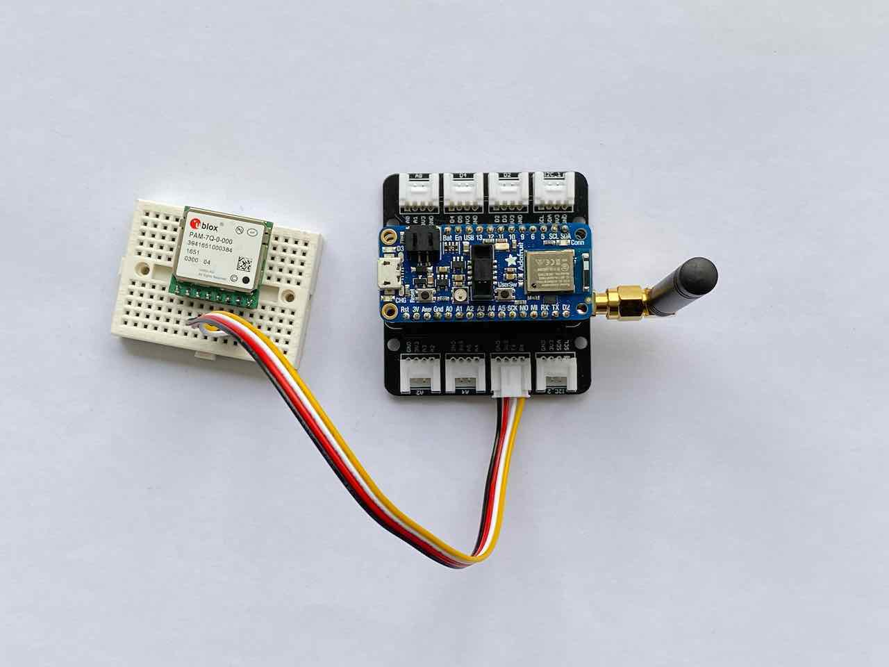
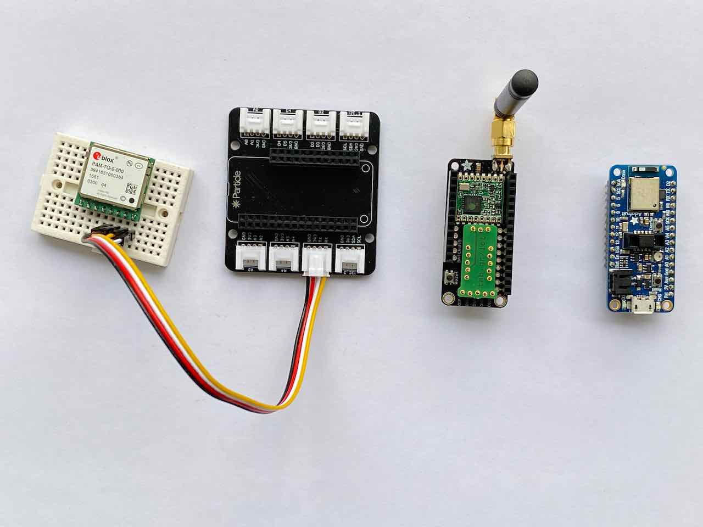
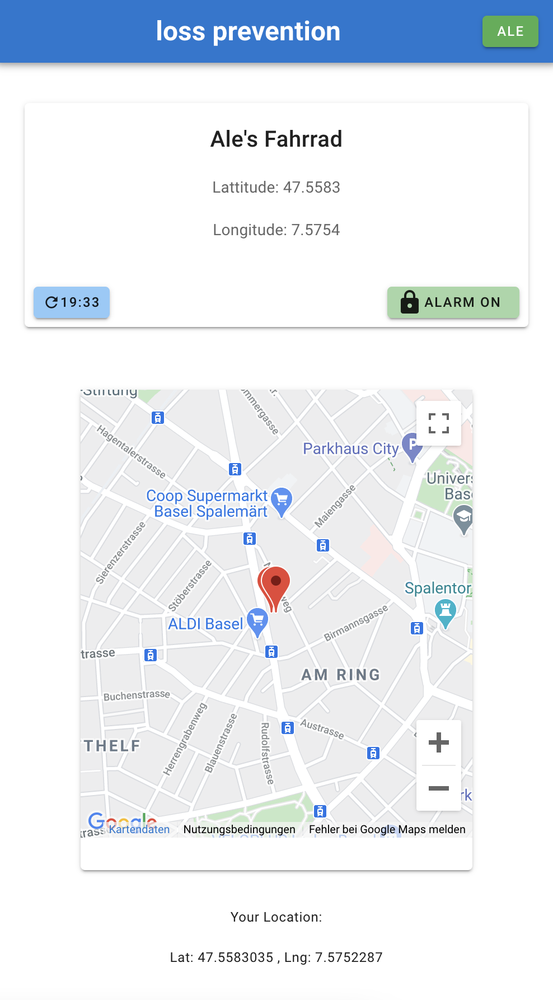
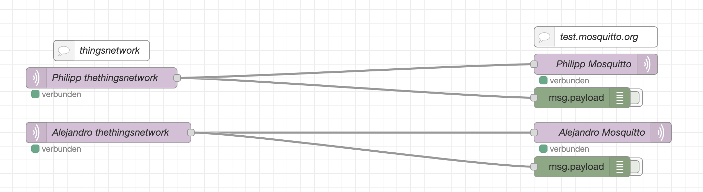
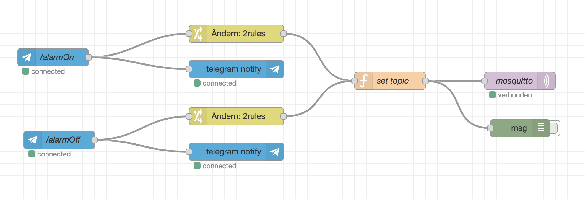
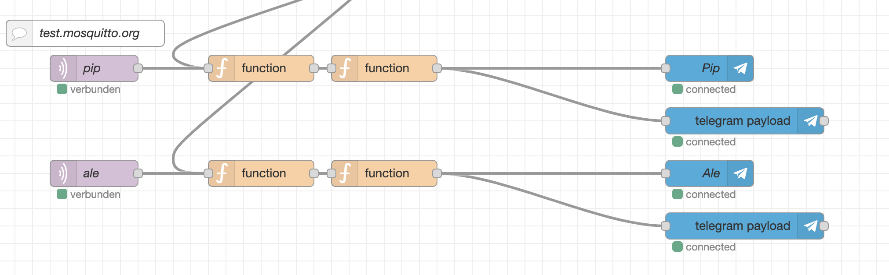
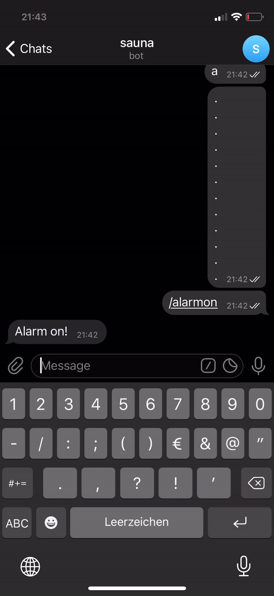

# fhnw iot project - lossprevention

## Project

A bicycle alarm system and tracker utilizing The Things Network's LoRaWAN infrastructure.

## Introduction

### Team members

[@palder](https://github.com/palder)

[@dev-ale](https://github.com/dev-ale)

## Deliverables

### Source code

#### Tracking Device

##### Source code

* [Feather nRF52840 Express Source Code](https://github.com/dev-ale/fhnw-iot-lossprevention/tree/master/arduino-code)

Credits: Code from the following sources has been used:

*  https://learn.sparkfun.com/tutorials/gps-logger-shield-hookup-guide/example-sketch-tinygps-serial-streaming

* https://www.thethingsnetwork.org/forum/t/best-practices-when-sending-gps-location-data-howto/1242/21

* LoRaWAN Arduino Code from Thomas Telkamp and Matthijs Kooijman


##### Software setup

You'll have to replace the `NWKSKEY[16]`, `APPSKEY[16]` and `DEVADDR` values in the nRF52840 source code  with values from the console on  [The Things Network](https://www.thethingsnetwork.org/)  (see below). 

```c++
static const u1_t PROGMEM NWKSKEY[16] = { 0x00, 0x00, 0x00, 0x00, 0x00, 0x00, 0x00, 0x00, 0x00, 0x00, 0x00, 0x00, 0x00, 0x00, 0x00, 0x00 };
static const u1_t PROGMEM APPSKEY[16] = { 0x00, 0x00, 0x00, 0x00, 0x00, 0x00, 0x00, 0x00, 0x00, 0x00, 0x00, 0x00, 0x00, 0x00, 0x00, 0x00 };
static const u4_t DEVADDR = 0x00000000;
```


##### Setup hardware

The following hardware is required for this project:

* Feather nRF52840 Express 
* FeatherWing RFM95W (LoRaWAN module)
* u-blox PAM-7Q GPS 
* Grove Shield for Feather
* Breadboard
* Grove - 4 pin Male Jumper to Grove 4 pin Conversion Cable








Build:

* Attach the *FeatherWing* to the *Grove Shield* 
* Attach the *nRF52840* ontop of the *FeatherWing*
* Place the *GPS module* on the breadboard
* Attach the *Grove Cable* to the UART Port on *Grove Shield* and ensure that the connection has the following mapping:
  * GPS (TX) <-> Grove Shield (RX) 
  * GPS (RX) <-> Grove Shield (TX)
  * GPS (VCC) <-> Grove Shield (VCC)
  * GPS (GND) <-> Grove Shield (GND)

##### Enclosure

This is a proof of concept and does not come with an enclosure. Depending on the availability of a power source and environment that the tracker is used in, a suitable enclosure may be selected.


#### Web Application



##### Features:
* Show the Location of the Bike on the Google Map
* Toggle between the 2 Views which represent Philipp's or Alejandro's Bike
* See when the last message came in
* See if the bike is moving
* See if Telegram Notifcations are enabled
* Track your own coordinate to see it on the map as well

##### Tech

* Vue.js Frontend Framework
* Websockets to communicate with our MQTT Broker
* Vuetify Vue.js Design Framework
* Google Maps js API


##### Source code

* [Vue.js Source Code](https://github.com/dev-ale/fhnw-iot-lossprevention/tree/master/src)


##### Setup software

###### Project setup
```
yarn install
```

###### Compiles and hot-reloads for development
```
yarn serve
```

###### Compiles and minifies for production
```
yarn build
```

#### Gateway with Node Red for Telegram Bot

###### MQTT Bridge


The MQTT Broker from thethingsnetwork is not accessable directly trough Websockets.
We have found a workaround, but this is only recomended in a Test Envirenment.
Since we planned a Node Red Integrating anyway, we created a MQTT Broker bridge in it.

For testing purposes we take the public broker from Mosquitto, which now subscribes to our topics from theThingsNetwork.
The Open MQTT Broker from Mosquitto supports Websockets out of the boxx and we can access all topics directly within our Web-App.


###### Telegram Integration


In this Nodes we configure the Telegram Bot.
We have 2 commands the user can send in to the Group Chat:
* /alarmOn -> turns on the notifications for the specific Bike of the User in Telegram
* /alarmOff -> turns off the notifications for the specific Bike of the User in Telegram

The Messages arrive in a group Chat where Philip and I are part of.
The /alarmOn command gets filtered by Telegram Username, so it will be distictive.
So everybody can turn on and off the notifications for their bike.

###### Send Coordinates to Telegram


If notifications are turned on for the specific bike, and a new coordinate comes in. The user gets notified directly in the Telegram Chat with the Location of the bike.



##### Setup hardware


#### 

#### The Things Network

* Create a free [The Things Network](https://www.thethingsnetwork.org/) account

* Setup an *Application* that uses `ABP` authentication and get the `Network Session Key`, `App Session Key` and `Device Address` for replacing values in the  nRF52840 source code.

* In the The Things Network Console configure the following *Payload Format decoder*:

  ```
  function Decoder(b, port) {
  
    var lat = (b[0] | b[1]<<8 | b[2]<<16 | (b[2] & 0x80 ? 0xFF<<24 : 0)) / 10000;
    var lng = (b[3] | b[4]<<8 | b[5]<<16 | (b[5] & 0x80 ? 0xFF<<24 : 0)) / 10000;
  
    return {
      location: {
        lat: lat,
        lng: lng
      }
    };
  }
  ```

  Credit: This decoder is from https://www.thethingsnetwork.org/forum/t/best-practices-when-sending-gps-location-data-howto/1242/21


#### TTN to ThingSpeak adapter


##### Source code


##### Setup


### Presentation

#### Use cases

The tracker does not acquire location data via GPS or transmit data via LoRaWAN until the accelerometer sensor registers movement.  This allows for very little power consumption during standby and only transmitting location updates when necessary. The alarm can be enabled using the web application, which triggers Telegram notification when new location updates are bing received. Since, location updates are always sent, the web application cannot only be used to retrieve a stolen bicycle but it may also be used when one has forgotten where the bike has been parked.


#### Reference model


#### Interface documentation


#### Issues


### Live demo

https://lossprevention.surge.sh/
